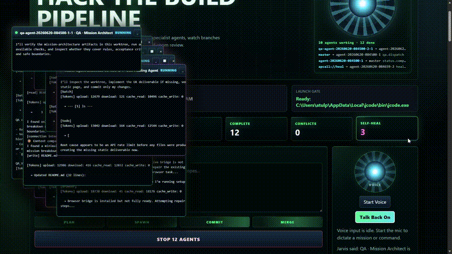

<div align="center">

# jcode‑jarvise · Multi‑Agent Coding Console

**A local control room that runs a whole team of coding agents from one screen — they plan, build in parallel, test their own work, and fix their own mistakes.**

[](LICENSE)
[](#quick-start)
[](https://github.com/atulpokharel-gp/jcode-jarvise/commits/main)
[](https://github.com/atulpokharel-gp/jcode-jarvise/stargazers)

[Features](#features) · [How It Works](#how-it-works) · [Quick Start](#quick-start) · [Configuration](#configuration) · [Docs](#documentation)

<br>



<sub><a href="assets/jarvis-console/demo/">More screenshots & full video →</a></sub>

</div>

---

## What is this?

**jcode‑jarvise** turns a single mission into a coordinated team of AI coding agents.

You describe what you want in a browser console. A **master** agent breaks the mission into a checklist, launches one **worker** agent per task — each isolated in its own git branch/worktree — and watches them work in parallel. When a worker finishes, the master sends in a **QA** agent to verify it actually works (including real browser testing for UIs). If something is broken, the work is handed **back to the agent that wrote it** to fix, then re‑tested. Finished branches are merged back together under review.

It is built on top of [**jcode**](#built-on-jcode), a fast, multi‑session coding‑agent harness — every worker, healer, and QA agent is a real `jcode run` process, not a simulation.

```bash
python scripts/jarvis_console.py
# open http://127.0.0.1:8765
```

---

## Features

- **🎯 One autonomous control.** A single **Launch Swarm** button drives the whole run — plan → whiteboard → workers — with no button sequence to memorize. It becomes **Stop Agents** while running and **Merge & Combine** when done.
- **📋 Live whiteboard checklist.** The mission is split into one task per agent. Each task moves `to‑do → in progress → done`, driven entirely by the real agent assigned to it — no mock state — with a progress bar, assignee, and branch.
- **🖥️ Per‑agent live consoles.** Every worker opens its own draggable, minimizable terminal window that streams its real `jcode run` log. Consoles pop up by themselves as workers start.
- **🔧 Self‑healing agents.** When a worker fails, the master automatically dispatches a healing agent into that worker's **own branch** — with the failed log as context — to diagnose and fix it, retrying before escalating. Exhausted work is recreated for another agent to pick up.
- **✅ QA + browser testing.** After a worker finishes, the master allocates a **QA agent** that builds, runs tests, and drives jcode's built‑in `browser` tool to confirm the UI actually works. On failure it reassigns the original agent and re‑verifies — a `verify → repair → verify` loop.
- **🗜️ Token‑saving work orders.** The master holds the full concept; each worker only receives a **compact headline + its own scoped objective**, not the whole spec — like a manager who doesn't hand the entire roadmap to every developer.
- **🔌 apcall protocol.** Agents coordinate over `apcall` (Agent Protocol Call), an inter‑agent message bus rendered live in the console, mirrored to an append‑only NDJSON session log, and exposed over a `/apcall/v1` HTTP transport for replay and external‑node ingest.
- **🌐 Remote MCP bridge.** A token‑protected, DevSpace‑style MCP server (`/mcp`) lets a remote client — ChatGPT, Claude — securely read, edit, search, run, and git‑manage your allow‑listed local projects (and launch a swarm) over a tunnel you control. Disabled by default. See [Remote MCP Bridge](docs/REMOTE_MCP_BRIDGE.md).
- **🧠 Smart model routing.** Workers are routed across OpenAI, Claude, and NVIDIA by a cost/quality strategy, with optional per‑agent provider/model overrides.
- **🎙️ Voice control.** Optional browser speech input and spoken status replies (say "launch swarm", "merge finished", …).

---

## How It Works

```
                         ┌──────────────┐
   mission ─────────────▶│    MASTER    │  plans · routes · merges · escalates
                         └──────┬───────┘
                  apcall bus    │   (plan.broadcast / task.dispatch / status / heal / qa)
        ┌──────────────┬────────┼────────┬──────────────┐
        ▼              ▼        ▼         ▼              ▼
   ┌────────┐     ┌────────┐         ┌────────┐     ┌────────┐
   │worker 1│     │worker 2│   ...   │ healer │     │   QA   │
   │branch 1│     │branch 2│         │ branch │     │ branch │
   └────────┘     └────────┘         └────────┘     └────────┘
        └──────────────┴───── merge & combine ──────┴──────────┘
```

1. **Plan.** The master compacts the mission into a checklist and a per‑task work order, and opens the whiteboard.
2. **Build.** One worker per task runs `jcode run` in its own git worktree/branch, in parallel. Each gets only a compact brief — the master keeps the full context.
3. **Test.** When a worker completes, a QA agent verifies it (tests + browser checks) and returns a `QA_VERDICT: PASS/FAIL`.
4. **Heal.** Failures (or QA fails) are routed back to the same agent on its own branch to fix, then re‑verified — bounded by retry limits.
5. **Combine.** The master merges completed, verified branches back into the base branch; conflicts stop for human review.

Everything is logged to an append‑only apcall session stream for full auditability.

---

## Quick Start

### Prerequisites

- **Python 3.10+** (runs the console server)
- **git**
- The **`jcode`** engine on your `PATH` (see below)
- At least one model provider key (OpenAI, Anthropic/Claude, or NVIDIA)

### 1. Get the jcode engine

This is a Rust project. Build it from source:

```bash
git clone https://github.com/atulpokharel-gp/jcode-jarvise.git
cd jcode-jarvise
cargo build --release
# put the built `jcode` binary on your PATH (or use scripts/install_release.sh)
```

Prefer a prebuilt engine? Install upstream jcode and point the console at it:

```bash
# macOS & Linux
curl -fsSL https://raw.githubusercontent.com/1jehuang/jcode/master/scripts/install.sh | bash
# Windows (PowerShell)
irm https://raw.githubusercontent.com/1jehuang/jcode/master/scripts/install.ps1 | iex
```

On Windows the console also auto‑detects `jcode` under `%LOCALAPPDATA%\jcode\` if it is not on `PATH`.

### 2. (Optional) enable browser testing

```bash
jcode browser status
jcode browser setup   # wires up the built‑in Firefox browser tool used by QA agents
```

### 3. Launch the console

```bash
python scripts/jarvis_console.py
```

Open **http://127.0.0.1:8765**, open **Settings** to add a provider API key, type a mission, and hit **Launch Swarm**.

---

## Configuration

- **Providers & keys** — set in the console's **Settings** modal (OpenAI, Claude, NVIDIA). Keys are stored only in the ignored local file `.jcode/jarvis-console/settings.json`. Each provider has an editable `model-id|tier|cost` list and a routing strategy (`cost saver` / `balanced` / `quality first`).
- **Agent limit** — scale from 1 up to 12 workers per mission.
- **Auto‑Repair / QA Check** — toggle the self‑healing and QA phases from the console.
- **Extra jcode flags** — pin provider/model flags for every worker:
  ```bash
  # PowerShell example
  $env:JARVIS_JCODE_ARGS = "--provider-profile nvidia-rotation --model moonshotai/kimi-k2.6"
  python scripts/jarvis_console.py
  ```
- **Custom binary** — `JARVIS_JCODE=C:\path\to\jcode.exe`
- **Auto‑run service** — the console can install a login‑startup entry (Windows Startup folder / Linux autostart) so it launches with your session.

Workers stay isolated in per‑agent worktrees under `.jcode/jarvis-console/`; the master merge happens in the root worktree where conflicts are visible and recoverable.

---

## Documentation

- [Jarvis Console — full guide](docs/JARVIS_CONSOLE.md)
- [apcall Network Protocol](docs/APCALL_NETWORK_PROTOCOL.md)
- [Remote MCP Bridge (DevSpace‑style)](docs/REMOTE_MCP_BRIDGE.md)
- [Swarm Architecture](docs/SWARM_ARCHITECTURE.md)
- [Memory Architecture](docs/MEMORY_ARCHITECTURE.md)
- [Browser Provider Protocol](docs/BROWSER_PROVIDER_PROTOCOL.md)
- [Safety System](docs/SAFETY_SYSTEM.md)
- [Windows Notes](docs/WINDOWS.md)

---

## Built on jcode

jcode‑jarvise is a fork of [**jcode**](https://github.com/1jehuang/jcode) by 1jehuang — a high‑performance, resource‑efficient coding‑agent harness built for multi‑session workflows, with a built‑in browser tool, agent swarm messaging, persistent server/client mode, and broad provider/OAuth support. The Jarvis console adds the master‑orchestrated, self‑healing, QA‑verified multi‑agent layer on top.

The full jcode CLI is still here:

```bash
jcode                       # interactive TUI
jcode run "say hello"       # one-shot, non-interactive
jcode serve && jcode connect# persistent background server + clients
jcode browser setup         # built-in browser automation
```

See the [upstream project](https://github.com/1jehuang/jcode) for the engine's benchmarks, provider login flows, and deep architecture notes.

---

## Roadmap

- WebSocket (`WSS`) apcall stream + `node.join`/`ack` handshake and capability auth (HTTP transport + session log already shipped)
- Integration QA on the **merged** result (today QA is per‑branch)
- Master‑generated, per‑agent interface contracts for even tighter token use
- ~~A short screen‑recording of a full mission run~~ — shipped ([demo/](assets/jarvis-console/demo/))

---

## Contributing

Issues and PRs welcome — see [CONTRIBUTING.md](CONTRIBUTING.md). The console backend lives in [`scripts/jarvis_console.py`](scripts/jarvis_console.py) and the UI in [`assets/jarvis-console/`](assets/jarvis-console/).

## License

MIT — see [LICENSE](LICENSE).
